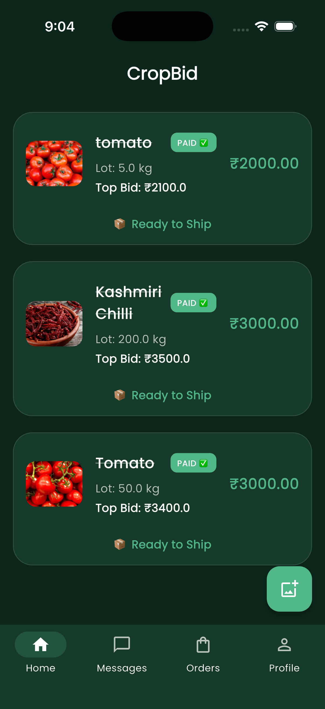
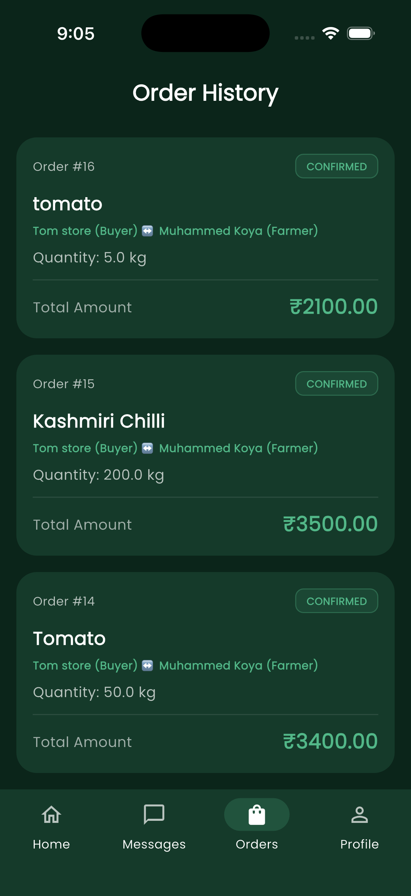
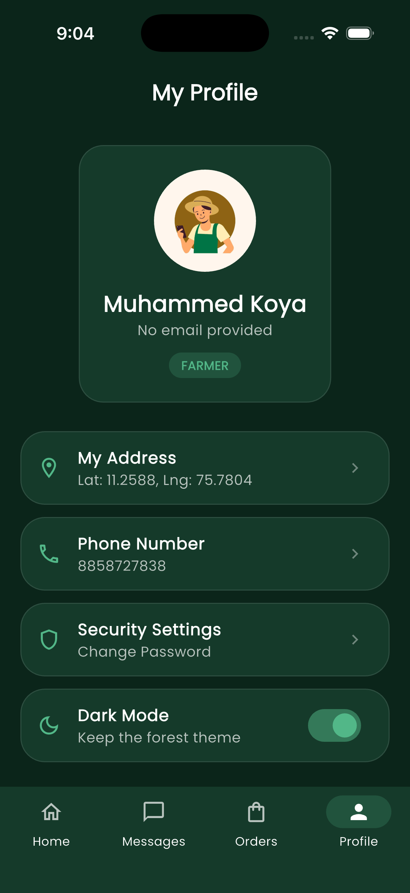

# CropBid – Full-Stack Auction E-commerce Platform

**CropBid** is a digital marketplace designed to bridge the gap between farmers and buyers through a real-time bidding system. By leveraging a full-stack architecture, it ensures transparent pricing and direct market access for agricultural produce.

---

> [!IMPORTANT]
> **Deployment Status:** This project is currently not hosted live due to infrastructure cost constraints. Please refer to the [Visual Walkthrough](#visual-walkthrough) section for screenshots of the application in action.

## 🚀 Key Features
* **Real-time Bidding:** Dynamic auction system for various crop categories.
* **User Roles:** Dedicated interfaces for Farmers (Sellers) and Buyers.
* **Secure Authentication:** JWT-based user verification and profile management.
* **Auction Management:** Farmers can list crops with base prices, while buyers can track their bid history.

## 🛠 Tech Stack

| Layer | Technology |
| :--- | :--- |
| **Frontend** | Flutter (Dart) |
| **Backend** | Django REST Framework (Python) |
| **Database** | PostgreSQL / SQLite |
| **Architecture** | RESTful API |

## 🎨 UI/UX & Design Philosophy
As the primary focus of this project transitioned toward **UI/UX design**, the interface was built with the following principles:
* **Accessibility:** Large touch targets and high-contrast text for outdoor use by farmers.
* **Efficiency:** A simplified 3-step listing process to reduce cognitive load.
* **Visual Hierarchy:** Clean cards and real-time status indicators (Active/Closed) to manage user urgency.

## 📸 Visual Walkthrough
*Since the app is not currently deployed, please find the interface highlights below:*

  
   
  

## 🏗 System Architecture
The application follows a decoupled architecture where the Flutter frontend communicates with the Django backend via a REST API. This ensures the UI remains snappy even when handling heavy database queries.

